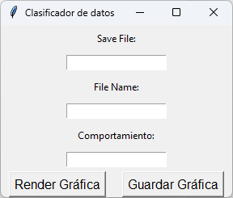
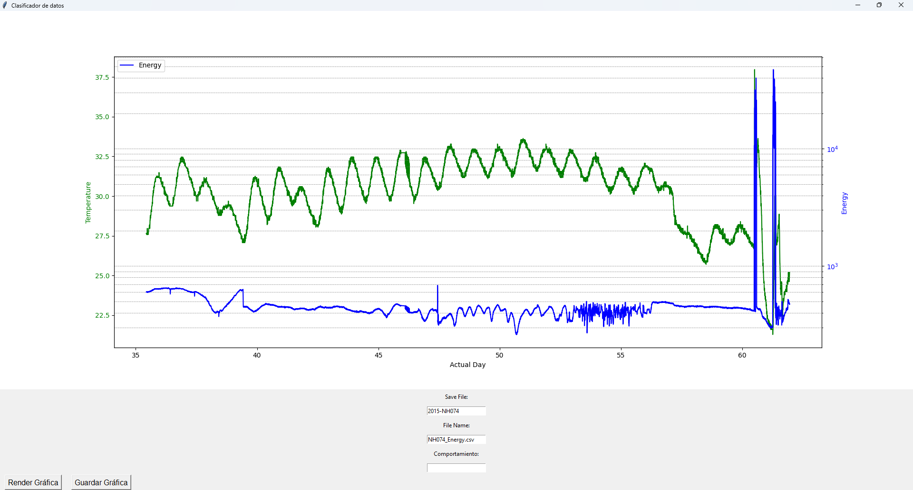

# Graph Classification
## Objective
> This project aims to plot and classify nest records, 
> taking the total measured energy and temperature from each record. The graph 
> is plotted with the elapsed days on the X-axis, and on the Y-axis, the temperature and total energy are plotted.

## How to run the program?
1. The following dependencies must be installed:
~~~ 
import numpy as np 
import pandas as pd
import matplotlib.pyplot as plt
import os
import shutil
import tkinter as tk
from tkinter import messagebox
from matplotlib.backends.backend_tkagg import FigureCanvasTkAgg
~~~
2. Once we have the dependencies installed, we can run the program.
3. To use the program correctly, it is necessary to have the CSV files that we will plot in the `txtFiles` folder.
4. The CSV file headers must be the following:
~~~
tDays,Energy,Count,EnergyPerCountFiltered,Temp,X,Y,Z,BIN_0,BIN_1,BIN_2,BIN_3,BIN_4,BIN_5,BIN_6,BIN_7,BIN_8,BIN_9,BIN_10,BIN_11,BIN_12,BIN_13,BIN_14,BIN_15,BIN_16,BIN_17,BIN_18,BIN_19,BIN_20,BIN_21,BIN_22,BIN_23,BIN_24,BIN_25,BIN_26,BIN_27,BIN_28,BIN_29
~~~
5. The program takes into account the `tDays`, `Energy`, and `Temp` headers.
6. When we run the program, it will appear as follows:

7. "Save file" will be the name of the folder created with the CSV and the graph (***IMPORTANT***: **Use the format YEAR-ID**).
8. "File Name" will be the name of the CSV file we will scan, and it must be in the `txtFiles` folder.
9. "Behavior" will be the behavior we define; it is recommended to use "normal", "infertile", "predated", "unclassifiable", or "over-washes".
10. The "Render Graph" button will display the graph. This will allow us to view the graph, but it is necessary to have the "Save File" and "File Name" fields filled in.
11. The "Save Graph" button will save the graph in our folder, move the CSV to the folder, and add the assigned behavior to the folder name.
12. If the "Render Graph" button is pressed once we have a rendered graph, the application will render a new graph with the data we have in "Save File" and "File Name".

## Example of use

---
# Clasificación de gráficas
## Objetivo
> Este proyecto busca graficar y clasificar los registros de nidos, 
> tomando de cada registro el total de energía medido y la temperatura. La gráfica se 
> realiza con los días transcurridos sobre el eje X y, en el eje Y, se grafica la temperatura y el total de energía.

## ¿Cómo ejecutar el programa?
1. Es necesario tener instaladas las siguientes dependencias:
~~~ 
import numpy as np 
import pandas as pd
import matplotlib.pyplot as plt
import os
import shutil
import tkinter as tk
from tkinter import messagebox
from matplotlib.backends.backend_tkagg import FigureCanvasTkAgg
~~~
2. Una vez que tenemos las dependencias instaladas, podemos ejecutar el programa.
3. Para poder usar el programa de forma correcta es necesario tener los archivos CSV que vamos a graficar en la carpeta `txtFiles`.
4. Los encabezados del archivo CSV deben ser los siguientes:
~~~
tDays,Energy,Count,EnergyPerCountFiltered,Temp,X,Y,Z,BIN_0,BIN_1,BIN_2,BIN_3,BIN_4,BIN_5,BIN_6,BIN_7,BIN_8,BIN_9,BIN_10,BIN_11,BIN_12,BIN_13,BIN_14,BIN_15,BIN_16,BIN_17,BIN_18,BIN_19,BIN_20,BIN_21,BIN_22,BIN_23,BIN_24,BIN_25,BIN_26,BIN_27,BIN_28,BIN_29
~~~
5. El programa toma en cuenta los encabezados `tDays`, `Energy` y `Temp`.
6. Cuando ejecutemos el programa lo veremos de la siguiente forma:

7. "Save file" será el nombre que tendrá la carpeta que se creará con el CSV y la gráfica (***IMPORTANTE***: **Usar el formato AÑO-ID**).
8. "File Name" será el nombre del CSV que escanearemos y que debe encontrarse en la carpeta `txtFiles`.
9. "Comportamiento" será el comportamiento que definamos; se recomienda usar "normal", "infertil", "depredado", "no-clasificable" o "over-washes".
10. El botón "Render Gráfica" nos mostrará la gráfica. Esto nos permitirá ver la gráfica, pero es necesario tener los campos "Save File" y "File Name" completados.
11. El botón "Guardar Gráfica" guardará la gráfica en nuestra carpeta, moverá el CSV a la carpeta y agregará al nombre de la carpeta el comportamiento asignado.
12. Si se presiona el botón "Render Gráfica" una vez que ya tenemos una gráfica renderizada, la aplicación va a renderizar una nueva gráfica con los datos que tengamos en "Save File" y "File Name".

## Ejemplo de uso

---

**Author**: Josue Norberto Aguilar Islas  
**Email**: [josueaguilarjnai@gmail.com](mailto:josueaguilarjnai@gmail.com)
